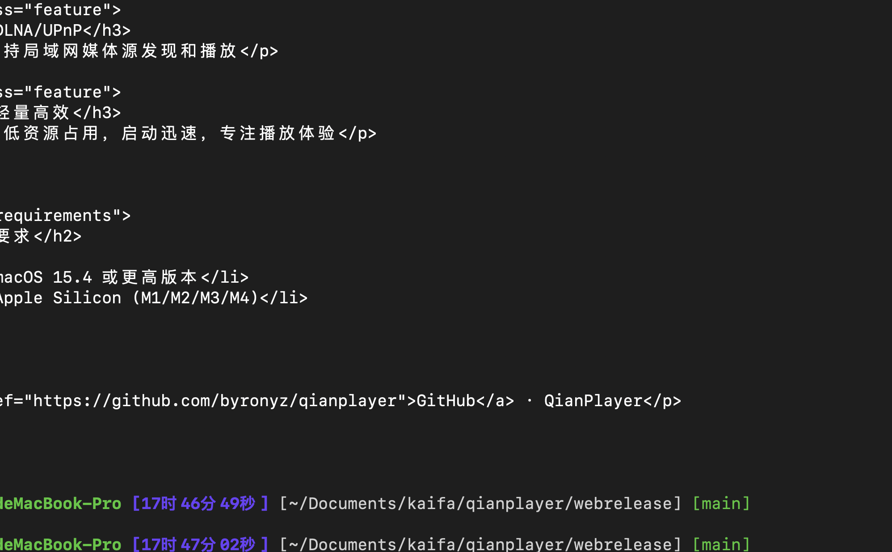

# QianPlayer

轻量、快速、功能丰富的 macOS 原生视频播放器。



## 特性

### 视频

- **硬件加速解码** — 硬解 H.264/H.265/VP9/AV1，CPU 占用极低
- **HDR 自动适配** — 识别 HDR10/HLG 内容，自动 tone-mapping
- **视频参数调节** — 亮度、对比度、饱和度、色相、伽马实时调整，支持灰度和旋转
- **字幕系统** — 多轨切换，外挂 SRT/ASS/SSA/VTT，延迟微调

### 音频

- **多音轨切换** — 自由选择视频内嵌的所有音频流
- **精确音量控制** — 0-120% 无级调节，静音记忆恢复
- **全格式解码** — AAC/FLAC/Opus/DTS/AC3/TrueHD 等

### 功能

- **文件源管理** — 添加本地文件夹，自动扫描索引，树形浏览 + 拼音搜索
- **DLNA / UPnP** — 作为渲染器接收投屏，手机/电视盒子直推播放
- **磁力链接** — 粘贴磁力链接边下边播，实时进度/速率显示
- **画中画 (PiP)** — 系统级浮窗置顶播放
- **播放列表** — 创建、管理、排序，自动记录播放历史
- **简拼快搜** — 输入文件名拼音首字母即可快速定位视频

## 系统要求

- macOS 15.4 (Sequoia) 或更高版本
- Apple Silicon (M1 / M2 / M3 / M4)

## 安装

### 从 DMG 安装

下载 [最新 Release](https://github.com/qianplayer/qianplayer/releases)，打开 DMG 拖入 Applications 即可。

> 首次打开如遇 Gatekeeper 拦截，右键点击 app → 选"打开"。

### 从源码构建

```bash
git clone https://github.com/qianplayer/qianplayer.git
cd qianplayer
make dmg
```

构建产物位于 `build/` 目录。

## 许可证

开源免费
