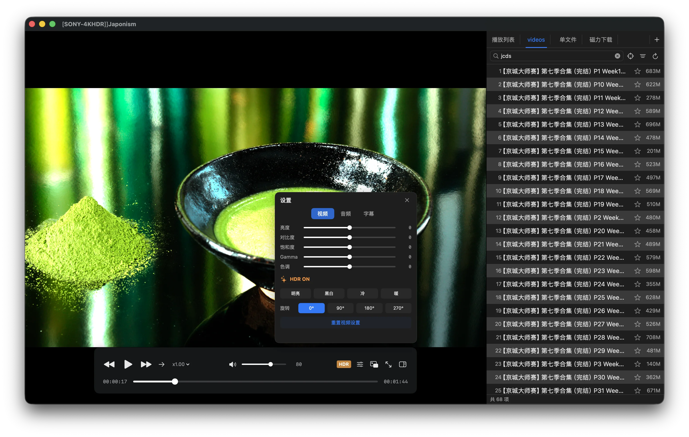

> 🌐 [简体中文](README_zh-Hans.md) | [繁體中文](README_zh-Hant.md) | [Français](README_fr.md) | [Deutsch](README_de.md) | [日本語](README_ja.md) | [Español](README_es.md) | [العربية](README_ar.md)

#  QianPlayer

A lightweight, fast, and feature-rich native video player for macOS.

## Features

### Video

- **Hardware-Accelerated Decoding** — Hardware decode H.264/H.265/VP9/AV1 with minimal CPU usage
- **Auto HDR Adaptation** — Detects HDR10/HLG content and applies automatic tone-mapping
- **Video Parameter Controls** — Real-time adjustments for brightness, contrast, saturation, hue, and gamma; supports grayscale and rotation
- **Subtitle System** — Multi-track switching, external SRT/ASS/SSA/VTT support, fine-tuned delay adjustment
- **mpv Decoding · Metal Native Rendering** — Powered by the mpv core decoding engine with a Metal-native render pipeline for zero-copy display, ultra-low latency, and full Apple Silicon GPU utilization

### Audio

- **Multi-Track Switching** — Freely select from all embedded audio streams
- **Spatial Audio** — Spatial audio rendering for an immersive surround sound experience
- **Universal Format Decoding** — AAC/FLAC/Opus/DTS/AC3/TrueHD and more

### Functionality

- **File Source Management** — Add local folders with automatic scanning and indexing, tree-view browsing
- **DLNA / UPnP** — Acts as a renderer to receive screen casting from phones and TV boxes
- **Magnet Links** — Paste a magnet link to stream while downloading, with real-time progress and speed display
- **Picture-in-Picture (PiP)** — System-level floating window for always-on-top playback
- **Playlists** — Create, manage, and sort playlists with automatic playback history

## System Requirements

- macOS 15.0 (Sequoia) or later
- Apple Silicon (M1 / M2 / M3 / M4)

## Installation

Download the [latest release](https://github.com/qianplayer/qianplayer.github.io/releases), open the DMG, and drag QianPlayer into Applications.

> If macOS blocks the first launch: open System Settings → Privacy & Security → scroll down to Security → click "Open Anyway" for QianPlayer.

## License

Free & Lightweight
